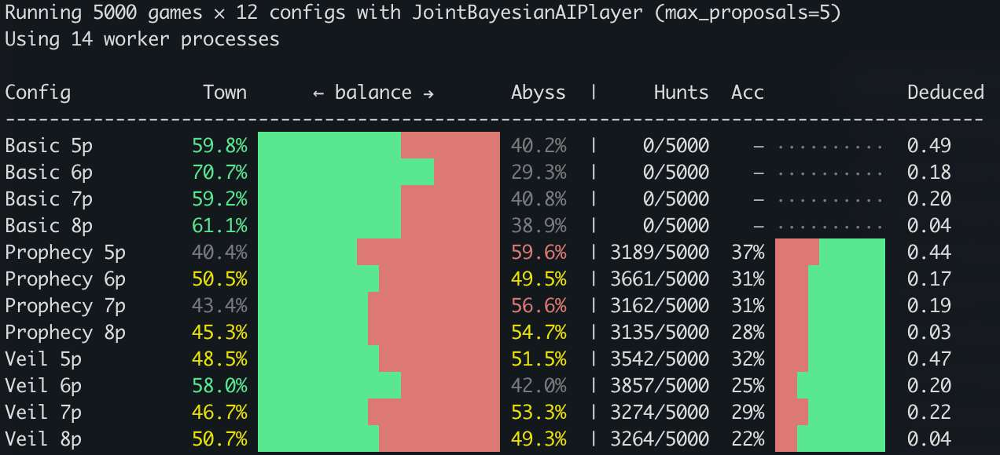

# TEYVALON AI v3：联合概率分布 + 统一加权随机决策模型

## 与 v2 的核心区别

### v2: 独立信念（Mean-Field）

每个玩家维护一个独立的 `b_j = P(j 是深渊)`，观察后逐人更新 log-odds，再通过 `_normalize_beliefs` 事后补丁修正全局约束。

**问题**：
- 无法表达玩家间的关联（"A 是坏人 → B 不太可能也是坏人"）
- 需要阻尼归一化，否则信念会发散
- Lauma 的月之力约束需要额外 hack
- 2 假桶的组合信号被低估

### v3: 联合分布 + 统一决策

维护一个精确的联合概率分布 `P(evil_set = S)`，枚举所有可能的深渊组合：

| 人数 | 深渊数 | 假设数 C(N-1, E) |
|------|--------|------------------|
| 5 | 2 | 6 |
| 6 | 2 | 10 |
| 7 | 3 | 20 |
| 8 | 3 | 35 |

**优势**：
- "恰好 E 个深渊"的约束天然满足，无需归一化补丁
- Lauma 的"月之力对恰好一好一坏"约束在初始化时直接过滤不合法假设
- 2 假桶能精确地排除所有不兼容的假设，信念更新更准
- 边际概率 `b_j` 通过对联合分布求和自动得出

## 核心理念

所有角色共享同一套决策逻辑 — 区别仅在 joint 的初始化和坏人的策略投票。不再有 cover beliefs、disguise rate、sigmoid 阈值等特殊机制。

## 1. 信念表示

用联合概率分布表示"谁是坏人"的信念：`joint[S] = P(S 是坏人组合)`。

- S 是一个玩家集合，代表一种"这些人是坏人"的假设
- 权重是该假设为真的概率，所有假设的权重之和 = 1
- 观察更新通过乘以似然度来调整权重，然后重新归一化

每个人（包括坏人）都假装自己是好人来维护信念：
- `_te = num_evil`（不是 `num_evil - 1`）
- `_b(self) = 0`（"我是好人"）

这意味着坏人的 joint 跟好人的 joint 结构完全一样，自然充当 cover belief。

## 2. 初始化

| 角色 | 初始化 |
|------|--------|
| 所有角色 | uniform prior: C(others, _te) 个假设等概率 |
| Lauma | 同上，但过滤掉月之力对不是恰好一个的假设 |

Columbina 不使用先验知识初始化（uniform = 完美伪装），但每轮任务结束后逐步利用全知信息（见 §3.4）。

## 3. 观察更新

### 3.1 投票观察（p_clean 加权连续模型）

看到投票后，用 `p_clean` 连续加权来更新信念：

1. 算 `p_clean = P(队里没坏人)`
2. 对每个投票者，算 agreement：
   - 投了赞成：`agreement = p_clean`（赞成干净队伍 = 合理）
   - 投了反对：`agreement = 1 - p_clean`（反对脏队伍 = 合理）
3. 队长 `strength = VOTE_STRENGTH_LEADER (0.6)`，其他人 `strength = VOTE_STRENGTH (0.5)`
4. 乘数 `w = 1 - strength × (2 × agreement - 1)`
5. 包含此人为坏人的假设 × `w`

当 `p_clean = 0.5` 时不做任何调整；`p_clean` 越极端，调整越大。队长因为主动选了这支队伍，信号更强。

### 3.2 任务结果观察（二项分布模型）

看到 f 个假桶后，假设每个坏人独立地以概率 q 放假桶。对每个假设 S，队里有 k 个坏人，用似然度更新 joint 权重：

```
joint[S] *= C(k, f) × q^f × (1-q)^(k-f)
```

公式拆解：
- `C(k, f)`：k 个坏人里选 f 个出来放假桶，有多少种选法
- `q^f`：被选中的 f 个坏人都放了假桶的概率
- `(1-q)^(k-f)`：剩下的 k-f 个坏人都选择隐藏的概率
- 乘起来就是"假设 S 为真时，观察到恰好 f 个假桶"的概率（似然度）

将似然度乘到 `joint[S]` 上，然后归一化 — 与观察更吻合的假设权重上升，矛盾的下降。

不可能的假设（`k < f` 或 `k = 0` 且 `f > 0`）直接从 joint 中删除而非置零，防止后续更新中意外回血。

q 随轮次递增（早期坏人倾向隐藏，晚期必须行动）：

| 轮次 | q |
|------|-----|
| 0 | 0.5 |
| 1 | 0.6 |
| 2 | 0.7 |
| 3+ | 0.8 |

代入几个典型场景（以 q=0.7 为例）：
- 队里没坏人（k=0），任务成功（f=0）：似然度 = 1，权重不变
- 队里 1 个坏人，但任务成功（f=0）：似然度 = 0.3（坏人藏了，可能但不太常见）
- 队里 2 个坏人，任务仍然成功（f=0）：似然度 = 0.09（两个都藏了，很少见，大幅削权）
- 队里 1 个坏人，出 1 个假桶（f=1）：似然度 = 0.7（正常行为）
- 队里 2 个坏人，只出 1 个假桶（f=1）：似然度 = 0.42（一个放了一个藏了）
- 队里 0 个坏人，却出了假桶（k<f）：似然度 = 0，直接排除

### 3.3 队长 q 值加成

队长主动选了这支队伍，如果是坏人，更可能是来搞事的。将队长嫌疑融入二项分布：

- 普通坏人：`q = q_base`
- 坏人队长：`q_leader = min(q_base + 0.2, 0.95)`

假设 S 中如果队长是坏人，用 `q_eff = (q_leader + q_base × (k-1)) / k` 作为该假设的有效 q 值。

效果（自然推导，无需手动 boost）：
- 任务失败：坏人队长假设的似然度更高（他更可能放假桶），嫌疑自然上升
- 任务成功：坏人队长假设的似然度更低（他不搞事更奇怪），嫌疑自然下降

### 3.4 Columbina 渐进揭示

Columbina 知道所有坏人身份，但不能一开始就用——太准会暴露自己给 Rerir 猎月。每轮任务结束后，逐步惩罚 joint 中包含已知好人的假设：

```
strength = 0.05 + 0.22 × wave
penalty = 1 - strength
对每个假设 S：wrong = S 中不是坏人的人数
joint[S] *= penalty ^ wrong
```

| 轮次 | strength | penalty | 累计效果 (1个错误假设) |
|------|----------|---------|----------------------|
| 0 | 0.05 | 0.95 | 0.95 |
| 1 | 0.27 | 0.73 | 0.69 |
| 2 | 0.49 | 0.51 | 0.35 |
| 3 | 0.71 | 0.29 | 0.10 |
| 4 | 0.93 | 0.07 | 0.007 |

效果：前 1-2 轮几乎不影响决策（Columbina 混在普通好人中），wave 3 后错误假设权重降到 10%，Columbina 开始主导组队和投票方向。

## 4. 组队（加权随机）

队长从所有可能的队伍中加权随机选一支。队伍必须包含自己，所以候选集 = 自己 + C(others, team_size-1)。

### 4.1 权重公式

```
weight = max(0.001, p_clean ^ SHARPEN)
```

- **`p_clean`**：从自己的 joint 算出"这支队里没有坏人"的概率。遍历所有假设 S，把 S 与队伍没有交集的那些假设概率加起来。p_clean 越高，越想选这支队。

- **SHARPEN = 2.5**：指数锐化。p_clean=0.9 vs 0.3 的队，原始比值 3:1，2.5 次方后变 ~15.6:1。让 AI 强烈偏好好队，但不是确定性选择。

- **max(0.001, ...)**：保底，确保任何队伍都不会被完全排除（概率极小但非零）。

### 4.2 分布特征

| 阶段 | p_clean 分布 | 选队行为 |
|------|-------------|---------|
| 开局（无观察） | 所有队伍 p_clean 相同（每人嫌疑均等） | 等价于随机选队 |
| 前中期（1-2 轮后） | 带"洗白"队友的队 p_clean 较高 | 偏好带可信队友，但仍有随机性 |
| 中后期（多轮后） | p_clean 两极分化 | 几乎锁定最优队，偶尔出意外 |

### 4.3 坏人组队降权

坏人队长额外检查 `_can_fail`：不能搞砸任务的队伍权重乘以 `(1 - urgency)`。赛点时几乎完全排除，平时只轻微降权。

### 4.4 统一性

好人和坏人用同一段逻辑。坏人的 joint 是 cover belief（假装自己是好人），所以坏人组队时选的也是"在假装好人的视角下看起来合理的队伍"，自然实现伪装，无需单独写坏人组队策略。

## 5. 投票

### 5.1 统一投票

```
if 我是队长:
    p_vote = p_clean ^ (1/SHARPEN)
else:
    p_vote = p_clean
return random.random() < p_vote
```

非队长：`p_clean` 直接作为赞成概率。队长：用 `p_clean^(1/SHARPEN)` 补偿组队时的锐化，让队长更倾向于支持自己选出来的队伍。

### 5.2 坏人策略投票

以 `_urgency()` 概率切换到策略投票。策略投票用 `_can_fail` 判断：队伍能搞砸任务就赞成，否则反对。双假桶轮自然要求 2+ 坏人。

### 5.3 特殊规则

- 最后一次组队机会：所有人强制赞成
- Lauma：两个月之力都在队里必须反对

## 6. 坏人共享判断

坏人的三个行动函数（组队/投票/放桶）共享两个辅助方法：

### 6.1 `_urgency()`

```
urgency = clamp(0.1, 0.95, 0.1 + 0.35 × town_score + 0.2 × abyss_score)
```

两个分数都贡献：town_score 驱动紧迫感，abyss_score 驱动进攻势头。比赛越深入越紧张。

| town | abyss | urgency |
|------|-------|---------|
| 0 | 0 | 0.10 |
| 0 | 1 | 0.30 |
| 1 | 0 | 0.45 |
| 1 | 1 | 0.65 |
| 2 | 0 | 0.80 |
| 0 | 2 | 0.50 |
| 2 | 1 | 0.95 |

### 6.2 `_can_fail(team, wave)`

队里坏人数 >= `fn(wave)` 则返回 true。双假桶轮（wave 3, >=7p）需要 2 个坏人才能 fail。

## 7. 放桶

- 好人：始终真桶
- 坏人先检查 `_can_fail` — 凑不够假桶就直接放真桶
- 紧急（town_sc >= 2）：必须放假桶
  - Rerir gambit：有队友且猎月信心高 → 放真桶赌猎月
- 普通：urgency lerp 模型
  ```
  base_fake = base × (1 - exposure)
  fake_prob = base_fake + urgency × (0.95 - base_fake)
  ```
  - base: Rerir 0.85 / Dottore 0.50 / 普通 0.70
  - exposure: 队里坏人数 / 队伍人数（坏人比例越高越暴露）
  - urgency 越高，fake_prob 越接近 0.95；urgency=0 时退化为 base_fake

## 8. 暴露模式（_exposed）

当坏人的 cover belief（joint）因决定性证据崩塌（joint 变空）时，进入暴露模式。
此时坏人不再伪装，全力搞事但避免暴露队友：

- **组队**：在能 fail 的队伍中 uniform 随机选（不因 p_clean 泄露偏好）
- **投票**：
  - 自己在队里 → `_can_fail` 判断
  - 不在队里 → urgency 概率帮队友（冒暴露风险），否则看是不是队友组的队（赞成）还是好人组的（大概率反对拖延）
- **放桶**：能 fake 就 fake

触发条件：坏人假装好人更新 joint 时，决定性证据（如 3 人队 2 假桶 = 队友全是坏人）与坏人的真实身份矛盾 → joint 所有假设被删光。

## 9. 猎月（滚动似然模型）

Rerir 为每个镇民维护一个滚动似然值 `_hunt[p]`，初始 1.0，每次观察乘以似然比：

### 9.1 观察更新

每次投票时，Rerir 用全知视角判断每人行为是否"正确"：

- **投票**：脏队投反对 / 干净队投赞成 = 正确
- **组队**：队长选了干净队伍 = 正确

正确行为 × `boost`，错误行为 × `1/boost`。boost 随轮次递增：

| 轮次 | boost | penalty |
|------|-------|---------|
| 0 | 1.3 | 0.77 |
| 1 | 1.5 | 0.67 |
| 2 | 1.7 | 0.59 |
| 3 | 1.9 | 0.53 |

早期信号弱（投票噪声大），晚期信号强（行为模式明显）。

### 9.2 猎月决策

`_columbina_scores()` 归一化 `_hunt` 为概率分布（和为 1）。
`hunt_columbina()` 用 `score ^ SHARPEN` 加权随机选择目标（非确定性最大值）。

### 9.3 Rerir gambit

当信心（归一化最大值）≥ 0.9 时，Rerir 在紧急局面可能选择放真桶赌猎月。

## 与 v2 的主要区别

| 项目 | v2 | v3 |
|------|-----|-----|
| 信念模型 | 独立 mean-field | 精确联合分布 |
| 组队 | 确定性最优 | 加权随机 |
| 投票 | 阈值 + sigmoid 噪声 | `random() < p_clean` |
| 坏人信念 | 独立 cover log-odds | 共用 joint（假装好人） |
| Columbina 伪装 | 随机翻转 + disguise_rate | 渐进揭示（前期隐藏，后期引领） |
| 投票观察 | 假设 pe ≠ pg 的贝叶斯 | p_clean 加权连续模型 |
| 任务观察 | 二项分布（每人独立枚举） | 二项分布（直接在 joint 上，q 随轮次递增） |
| 代码量 | ~450 行 | ~250 行 |

## 当前平衡（5000 局 benchmark）


